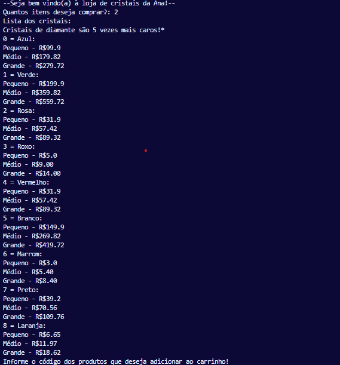
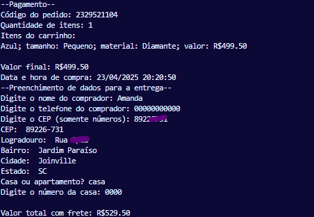
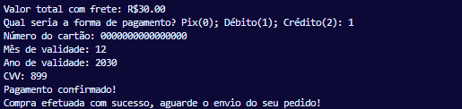

# 💎 Loja de Cristais (via Terminal)

Projeto desenvolvido como trabalho final de uma disciplina, com o objetivo de simular uma loja virtual que permite a compra de cristais através do terminal. O sistema conta com funcionalidades de carrinho de compras, cálculo de frete, e diferentes formas de pagamento.

## 🛍️ Funcionalidades

- Lista de cristais disponíveis com variações de tamanho e material (quartzo ou diamante)
- Adição de itens ao carrinho com cálculo automático de preços
- Cadastro de endereço com validação de CEP via API [ViaCEP](https://viacep.com.br/)
- Cálculo de frete baseado na cidade
- Pagamento via:
  - 💸 Pix (com geração de QR Code)
  - 💳 Débito
  - 💳 Crédito (com parcelamento em até 12x)
- Armazenamento dos pedidos em arquivo `pedidos.json`

## ⚙️ Como executar

### Pré-requisitos

Você vai precisar ter o Python instalado na sua máquina. Também será necessário instalar alguns pacotes:

```bash
pip install qrcode[pil] pillow
```

### Execução

Clone o repositório e execute o script:

```bash
python codigosjuntos.py
```

## 📸 Exemplo de execução

Abaixo alguns prints mostrando como o programa funciona:

### 🧾 Escolha de produtos


### 📦 Preenchimento dos dados de entrega


### 💳 Escolha da forma de pagamento


### 📄 QR Code gerado (se pagamento via Pix)


## 📁 Estrutura do Código

O código está todo no arquivo `codigosjuntos.py`, com funções organizadas da seguinte forma:

- Validação de entrada (número de cartão, data etc.)
- Geração de QR Code (pagamento via Pix)
- Captura de dados do comprador e endereço
- Lógica de carrinho e pagamento
- Salvamento do pedido em arquivo

## 📦 Dados salvos

Cada compra realizada é registrada em um arquivo chamado `pedidos.json`, com informações como:

- Código do pedido
- Lista de itens comprados
- Valor total e frete
- Informações de entrega e pagamento

## 🎓 Motivação

Este projeto foi desenvolvido como atividade final para consolidar os aprendizados da disciplina, praticando conceitos como:

- Manipulação de listas e dicionários
- Entrada e validação de dados
- Consumo de API
- Modularização e organização de código
- Uso de bibliotecas externas como `qrcode` e `PIL`

---


